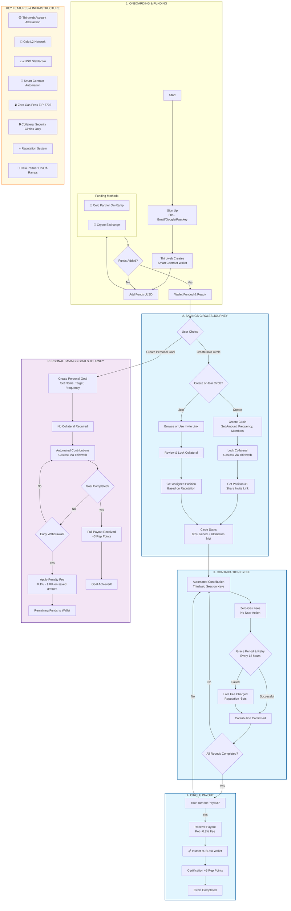

```mermaid
flowchart TD
    subgraph A [1. ONBOARDING & FUNDING]
        direction TB
        A1[Start] --> A2[Sign Up<br>60s - Email/Google/Passkey]
        A2 --> A3[Thirdweb Creates<br>Smart Contract Wallet]
        A3 --> A4[Add Funds cUSD]
        
        subgraph A4_Sub [Funding Methods]
            A4_1[🏦 Celo Partner On-Ramp]
            A4_2[🔄 Crypto Exchange]
        end
        
        A4 --> A4_Sub
        A4_Sub --> A5{Funds Added?}
        A5 -- Yes --> A6[Wallet Funded & Ready]
        A5 -- No --> A4
    end

    A6 --> B{User Choice}
    
    subgraph C [2. SAVINGS CIRCLES JOURNEY]
        B -- Create/Join Circle --> C1{Create or Join Circle?}
        
        C1 -- Create --> C2[Create Circle<br>Set Amount, Frequency, Members]
        C2 --> C3[Lock Collateral<br>Gasless via Thirdweb]
        C3 --> C4[Get Position #1<br>Share Invite Link]
        C4 --> C5[Circle Starts<br>80% Joined + Ultimatum Met]
        
        C1 -- Join --> C6[Browse or Use Invite Link]
        C6 --> C7[Review & Lock Collateral]
        C7 --> C8[Get Assigned Position<br>Based on Reputation]
        C8 --> C5
    end

    subgraph D [3. CONTRIBUTION CYCLE]
        C5 --> D1[Automated Contribution<br>Thirdweb Session Keys]
        D1 --> D2[Zero Gas Fees<br>No User Action]
        D2 --> D3{Grace Period & Retry<br>Every 12 hours}
        D3 -- Successful --> D4[Contribution Confirmed]
        D3 -- Failed --> D5[Late Fee Charged<br>Reputation -5pts]
        D5 --> D4
        D4 --> D6{All Rounds Completed?}
        D6 -- No --> D1
    end

    subgraph E [4. CIRCLE PAYOUT]
        D6 -- Yes --> E1[Your Turn for Payout?]
        E1 -- Yes --> E2[Receive Payout<br>Pot - 0.2% Fee]
        E2 --> E3[💰 Instant cUSD to Wallet]
        E3 --> E4[Certification +6 Rep Points]
        E4 --> E5[Circle Completed]
        E1 -- No --> D1
    end

    subgraph F [PERSONAL SAVINGS GOALS JOURNEY]
        B -- Create Personal Goal --> F1[Create Personal Goal<br>Set Name, Target, Frequency]
        F1 --> F2[No Collateral Required]
        F2 --> F3[Automated Contributions<br>Gasless via Thirdweb]
        F3 --> F4{Goal Completed?}
        F4 -- No --> F5{Early Withdrawal?}
        F5 -- No --> F3
        F5 -- Yes --> F6[Apply Penalty Fee<br>0.1% - 1.0% on saved amount]
        F6 --> F7[Remaining Funds to Wallet]
        F4 -- Yes --> F8[Full Payout Received<br>+3 Rep Points]
        F8 --> F9[Goal Achieved!]
    end

    subgraph G [KEY FEATURES & INFRASTRUCTURE]
        G1[🟡 Thirdweb Account Abstraction]
        G2[💚 Celo L2 Network]
        G3[💵 cUSD Stablecoin]
        G4[🤖 Smart Contract Automation]
        G5[⛽ Zero Gas Fees EIP-7702]
        G6[🔒 Collateral Security Circles Only]
        G7[⭐ Reputation System]
        G8[🏦 Celo Partner On/Off-Ramps]
    end

    %% Styling for clarity
    classDef primaryJourney fill:#e1f5fe,stroke:#01579b,stroke-width:2px
    classDef goalJourney fill:#f3e5f5,stroke:#4a148c,stroke-width:2px
    classDef infrastructure fill:#fff8e1,stroke:#ff6f00,stroke-width:1px
    
    class C,D,E primaryJourney
    class F goalJourney
    class G infrastructure
```
